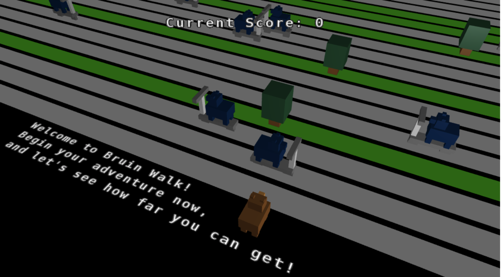

Bruin Walk is an endless road crossing game. The goal is to control the player (Bruin) to move forward, avoidng any obstacles (scooters) on the way. Your final score will be calculated based on how far you get. The keyboard controls for this game is pretty straightforward. You may use the 'w' key to move forward, the 's' key to move back, the 'a' key to move left, and the 'd' key to move right. Start your adventure on Bruin Walk now!

